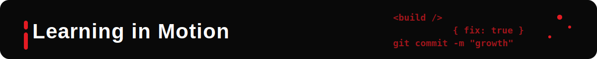

  

---

- Full-stack web development
- Backend API development
- Frontend application development
- Database design and integration
- Agile project workflows
- Real-world client-style projects
- Technical documentation and handovers

---

  

Projects here are often built by teams, giving learners experience with:

- Branching and pull requests
- Code reviews
- Feature planning
- Bug fixing
- Testing
- Documentation
